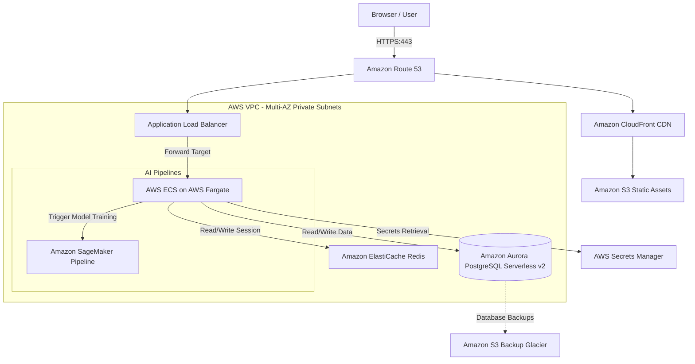

# AI-Based Threat Intelligence Platform

An enterprise-grade, production-ready SaaS Security Operations Center (SOC) dashboard. The system features a custom, high-fidelity **Dark Cyber Security Theme** with glassmorphism panels, real-time threat intelligence feeds aggregator, scikit-learn anomaly prediction models, an interactive force-directed network relationship graph, a custom SVG-based world attack map, and a browser-native voice-synthesizing AI Cyber Assistant terminal.

---

## Key Features

1. **Gatekeeper Authentication Portal**: Integrated JWT token security with simulated sliding 2FA verification.
2. **Dynamic SOC Dashboard**: Live KPI tracking widgets (indexed threats, critical metrics, incident queues) and a streaming ingestion log table.
3. **Curated Threat Feeds Ingress**: Normalize indicators from OpenCTI, AbuseIPDB, AlienVault OTX, NVD CVE, MISP, and VirusTotal.
4. **AI Threat Analysis Engine**: Random Forest classification (DDoS, Malware, Phishing) and Isolation Forest anomaly score checks.
5. **Interactive Attack Map**: Cyberpunk dot-matrix world map displaying flowing threat coordinates and attack arcs using SVG Bezier paths.
6. **Force-Directed Threat Explorer**: SVG network relationship visualization linking IOC search items to malware files, geolocations, and servers.
7. **AI Cyber Assistant Terminal**: Natural language chat support featuring typing streaming animations, recommendation plays, and text-to-speech voice synthesis.

---

## Project Directory Tree

```
AI-Based-Threat-Intelligence-Platform/
├── backend/
│   ├── app/
│   │   ├── api/                  # API routing (auth, threats, incidents, settings, logs)
│   │   │   └── endpoints.py
│   │   ├── core/                 # JWT security, SQLite connection, configs
│   │   │   ├── config.py
│   │   │   ├── database.py
│   │   │   └── security.py
│   │   ├── models/               # SQLAlchemy ORM schemas
│   │   │   └── models.py
│   │   ├── schemas/              # Pydantic validation structures
│   │   │   └── schemas.py
│   │   ├── services/             # AI engines and Feeds Normalization aggregator
│   │   │   ├── ai_engine.py
│   │   │   └── feeds_aggregator.py
│   │   └── main.py               # FastAPI application bootstrapper & DB Seeder
│   ├── requirements.txt          # Python packages
│   └── Dockerfile                # Backend container script
├── frontend/
│   ├── src/
│   │   ├── components/
│   │   │   ├── chat/             # AI Chat Assistant console
│   │   │   │   └── ChatAssistant.tsx
│   │   │   ├── map/              # SVG world arc map
│   │   │   │   └── ThreatMap.tsx
│   │   │   └── visualizer/       # Force link relationship graph
│   │   │       └── ThreatExplorer.tsx
│   │   ├── context/              # Context Providers (AuthContext.tsx)
│   │   ├── pages/                # Login Portal and main SOC Dashboard views
│   │   │   ├── Login.tsx
│   │   │   └── Dashboard.tsx
│   │   ├── App.tsx               # Main routing component
│   │   └── index.css             # Tailwind v4 directives & matrix grid styling
│   ├── package.json              # Vite-React dependencies
│   ├── tailwind.config.js        # Styling configuration
│   ├── postcss.config.js         # Postcss compiler plugins setup
│   └── Dockerfile                # Frontend Alpine container script
├── docker-compose.yml            # Multi-service container orchestration config
└── README.md                     # Technical documentation
```

---

## Getting Started

### Prerequisites
Make sure you have [Node.js (v20+)](https://nodejs.org/) and [Python (3.11+)](https://www.python.org/) installed, or [Docker Desktop](https://www.docker.com/products/docker-desktop/) running.

### 1. Docker Compose Installation (Recommended)
Launch the entire system in containerized state with a single command from the project root:
```bash
docker-compose up --build
```
* **Frontend Access**: `http://localhost:5173`
* **FastAPI Swagger docs**: `http://localhost:8000/docs`

---

### 2. Manual Local Setup

#### A. Backend Setup
1. Navigate to the backend directory:
   ```bash
   cd backend
   ```
2. Create and activate a virtual environment:
   ```bash
   python -m venv venv
   # Windows
   .\venv\Scripts\activate
   # Linux/Mac
   source venv/bin/activate
   ```
3. Install the dependencies:
   ```bash
   pip install -r requirements.txt
   ```
4. Start the FastAPI development server:
   ```bash
   uvicorn app.main:app --reload --port 8000
   ```
   *Note: On boot, the database schema is automatically built in `threat_intel.db` (SQLite) and seeded with mock Admin and Analyst accounts.*

#### B. Frontend Setup
1. Navigate to the frontend directory:
   ```bash
   cd ../frontend
   ```
2. Install npm packages:
   ```bash
   npm install
   ```
3. Boot the Vite development server:
   ```bash
   npm run dev
   ```
4. Open your browser to `http://localhost:5173`.

---

## Default Seed Accounts
For direct access during local testing, click the **Demo Accelerators** on the Login Page, or fill manually:
- **Analyst Portal**: `analyst` / `password123`
- **Admin Portal**: `admin` / `password123`

---

## Database ER Diagram Schema

The PostgreSQL/SQLite database models represent twelve tables capturing standard platform telemetry:
- **Users, Roles, Permissions, RolePermissions**: Implements Role-Based Access Control (RBAC).
- **Threats, ThreatFeeds**: Normalizes active malware, DDoS, and exfiltration logs from aggregated indices.
- **Incidents**: Tickets assigned to analysts to track SOC containment workflow.
- **Alerts**: Notification triggers mapped across system webhooks, slack channels, and email logs.
- **AI Recommendations**: Explanations and confidence intervals compiled by AI Classifiers.
- **Audit Logs**: Secure, immutable activity trackers logging user logins and sync functions.

---

## AWS Production Architecture Blueprint

An enterprise-ready SaaS installation on AWS features multi-region high availability and robust data segregation:



### AWS Infrastructure Core Components:
1. **Network Layer**: Private subnets across multiple availability zones. Ingress routes restricted via Security Groups allowing traffic only from the Application Load Balancer.
2. **ECS Fargate**: Containerized execution scaling automatically on CPU utilization, completely avoiding server management.
3. **Database Core**: Multi-AZ Amazon Aurora Serverless v2 (PostgreSQL) automatically scaling from 0.5 to 64 ACUs, capturing spikes in event ingest rates.
4. **Credential Secrets Management**: AWS Secrets Manager encrypting feed API keys (AbuseIPDB, AlienVault OTX, VirusTotal) with automatic 30-day rotation.

---

## Production Security Compliance (OWASP Checklist)

- **SSL/TLS**: Mandatory HTTPS transport utilizing AWS ACM certificates with TLS 1.3 enforced.
- **Password Strength**: Hashed storage via bcrypt with a work factor of 12.
- **Authorization**: JSON Web Tokens (JWT) signed using HS256 with 24-hour expiration settings.
- **SQL Injection**: Complete prevention using SQLAlchemy parameterized ORM queries.
- **MFA Compliance**: Integrated RFC 6238 TOTP validation checks.

---

## Production Roadmap
- [ ] **Multi-Tenant Data Segregation**: Implement PostgreSQL Schema-based tenancy rules to partition enterprise clients.
- [ ] **Grafana integration**: Forward audit logs and ingest indicators to Prometheus and Grafana alerting boards.
- [ ] **Real-time WebSockets**: Upgrade the SSE dashboard feed to bidirectional WebSockets for active chat assistant sync.
